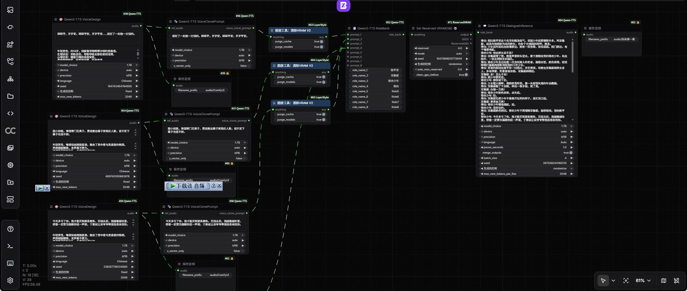

# ComfyUI-Qwen-TTS-5x

[English](README.md) | 中文版

> **✅ 本分支已支持 transformers 5.x**
>
> 本分支已适配 **transformers 5.x**，在 transformers 5.14.1 / ComfyUI 0.37.0 / torch 2.13.0 下验证通过。
> 上游 v1.0.7 声明的依赖为 `transformers>=4.57.0,<5.0.0`；如需原始 4.x 行为，请使用固定到 4.57.3 的上游版本。

---

## 关于本分支

本仓库是 [flybirdxx/ComfyUI-Qwen-TTS](https://github.com/flybirdxx/ComfyUI-Qwen-TTS)（Apache-2.0）的分支，用于 transformers 5.x 环境。

### 为什么要做适配

上游 v1.0.7 的 `requirements.txt` 声明 `transformers>=4.57.0,<5.0.0`。在不降级共享 ComfyUI 环境的前提下，直接对涉及的四个文件做了定向适配。每项修复都是通过实测验证的，而不是靠阅读代码。

### 修复内容

| # | 问题 | 影响 |
|---|---|---|
| 1 | 5.x 不再将 `pad_token_id` 复制到 `PretrainedConfig` | 加载时 `AttributeError` |
| 2 | 5.14 删除了 `ROPE_INIT_FUNCTIONS["default"]` | 改为本地实现未缩放版（映射到 `"linear"` 会错） |
| 3 | `create_causal_mask` 签名变更（`input_embeds` -> `inputs_embeds`，移除 `cache_position`） | 调用时适配签名 |
| 4 | decode 阶段 `cache_position` 传入为 `None` | **崩溃**：`mat1 and mat2 shapes cannot be multiplied (1x55296 and 2048x2048)` |
| 5 | `inv_freq` 为未初始化的 meta 内存 | **静默失败**：能生成音频但音色完全错误，不报错 |
| 6 | `layer_type_validation` 降级 shim 每次调用都打日志 | 每次加载模型重复刷屏 59 行 |
| 7 | `ProgressBar(total)` 默认 `node_id=None` | 面板中完全不显示进度 |
| 8 | `generate()` 是单个阻塞调用 | 生成期间进度条僵死 |
| 9 | 步计数变负（`input_ids` 不包含 prefill） | 进度条直接跳到 100% |
| 10 | ComfyUI 0.37 未注册 `CLIProgressHandler` | 新增独立的 stderr 控制台进度条 |

其中第 5 条最值得注意：它不会报错、也不会记日志。模型只是产出无意义的声学帧，很容易被误判为参考音频的问题。

### 安装方式

四种方式选其一，结果完全相同：`ComfyUI/custom_nodes/` 下出现一个
叫 `ComfyUI-Qwen-TTS-5x` 的文件夹。

#### 1. ComfyUI Manager（最简单）

1. 打开 ComfyUI，点击 **Manager**
2. **Custom Nodes Manager** -> **Install Custom Nodes**
3. 在搜索框或 URL 框里粘贴：
   ```
   https://github.com/jesse890423/ComfyUI-Qwen-TTS-5x
   ```
4. 点击 **Install**，按提示重启 ComfyUI

Manager 会自动处理下载和依赖安装。

#### 2. git clone

```bash
cd ComfyUI/custom_nodes
git clone https://github.com/jesse890423/ComfyUI-Qwen-TTS-5x.git
cd ComfyUI-Qwen-TTS-5x
..\..\..\python_embeded\python.exe -m pip install -r requirements.txt
```

如果你用的不是便携版 ComfyUI，请自行调整 `python_embeded` 的路径。

#### 3. 下载 zip 压缩包

1. 在仓库页面：**Code** -> **Download ZIP**
2. 解压。zip 里的文件夹名为 `ComfyUI-Qwen-TTS-5x-main`
   —— **要改名为 `ComfyUI-Qwen-TTS-5x`**（去掉 `-main`）。
   目录名很重要：ComfyUI 会根据文件夹名识别节点主体，
   而这个名也是 Manager 以后能识别并更新插件的依据。
3. 把改名后的文件夹移入 `ComfyUI/custom_nodes/`，最终得到：
   ```
   ComfyUI/custom_nodes/ComfyUI-Qwen-TTS-5x/
   ```
   不要变成 `ComfyUI-Qwen-TTS-5x-main`，也不要把文件散放到
   `custom_nodes/` 下。
4. 安装依赖：
   ```bash
   cd ComfyUI/custom_nodes/ComfyUI-Qwen-TTS-5x
   ..\..\..\python_embeded\python.exe -m pip install -r requirements.txt
   ```
5. 重启 ComfyUI

#### 4. 手动复制

把本仓库的内容复制到新建的文件夹
`ComfyUI/custom_nodes/ComfyUI-Qwen-TTS-5x`，安装 `requirements.txt`，重启 ComfyUI。

#### 接着对模型

本插件不会自动下载任何文件。模型权重的放置位置请参见下方
[模型目录结构示意](#模型目录结构示意)。

### 如果节点没有出现

1. 查看 ComfyUI 控制台，是否有关于本插件的报错
2. 确认路径恰好是 `ComfyUI/custom_nodes/ComfyUI-Qwen-TTS-5x/__init__.py`
3. 确认已安装 transformers：`pip show transformers`
4. 完全重启 ComfyUI（不是只刷新浏览器页面）

### 不要同时安装两个版本

本分支保留了上游的节点类名（`FB_Qwen3TTS*`），以保持现有工作流可继续使用。因此本分支与上游注册的**是同一批节点类名**，同时启用会冲突。

请二选一：

| | transformers | 目录 |
|---|---|---|
| 本分支 | 4.57+ **以及 5.x** | `ComfyUI-Qwen-TTS-5x` |
| [上游](https://github.com/flybirdxx/ComfyUI-Qwen-TTS) | 仅 4.57.x | `ComfyUI-Qwen-TTS` |

如需切换，请禁用或删除另一个（将其目录改名为 `<name>.disabled`，或用 Manager 的 Disable 按钮）。

### 验证环境

```
ComfyUI        0.37.0
transformers   5.14.1
torch          2.13.0+cu130
插件\ComfyUI-Qwen-TTS v1.0.7
```

### 许可证

Apache License 2.0 —— 见 [LICENSE](LICENSE) 与 [NOTICE](NOTICE)。

本分支仅修改插件自己的代码。**模型权重不包含在本仓库中**，仍遵循阿里云市的 Qwen3-TTS 模型使用许可。



基于阿里巴巴 Qwen 团队开源的 **Qwen3-TTS** 项目，为 ComfyUI 实现的语音合成自定义节点。

## 📋 更新日志

- **2026-04-12 (v1.0.7)**: 移除 `QwenTTSConfigNode`（因分段生成导致音色不一致）；修复 MPS 精度 bug 和 CustomVoice 通道不匹配问题；代码清理 ([update.md](doc/update.md))
- **2026-02-04**: 添加 `extra_model_paths.yaml` 支持 ([update.md](doc/update.md))
- **2026-01-29**: 功能更新：支持加载自定义微调模型和 Speaker ([update.md](doc/update.md))
  - *注意：微调功能目前为实验性；推荐直接使用声音克隆以获得最佳效果。*
- **2026-01-27**：功能优化：精简 LoadSpeaker UI，修复 PyTorch 兼容性 ([update.md](doc/update.md))
- **2026-01-26**：功能更新：新增声音持久化系统 (SaveVoice / LoadSpeaker) ([update.md](doc/update.md))
- **2026-01-24**：添加注意力机制选择和模型内存管理功能 ([update.md](doc/update.md))
- **2026-01-24**：为所有 TTS 节点添加生成参数 (top_p, top_k, temperature, repetition_penalty) ([update.md](doc/update.md))
- **2026-01-23**：依赖兼容性与 Mac (MPS) 支持，新增节点：VoiceClonePromptNode, DialogueInferenceNode ([update.md](doc/update.md))

## 示例工作流

可直接使用的工作流位于 [`example/`](example/) 目录：

| 文件 | 内容 |
|---|---|
| `example.json` | 基础合成 |
| `Custom Save Voice.json` | 保存音色以复用 |
| `Multi-character dialogue.json` | 多角色对话 |
| `Model Fine-Tuning and Workflow Usage.json` | 微调配置 |

## 功能特性

- 🎵 **语音合成**: 高质量的文本转语音功能。
- 🎭 **声音克隆**: 支持从短音频示例进行零样本（Zero-shot）声音克隆。
- 🎨 **声音设计**: 支持通过自然语言描述自定义声音特质。
- 🚀 **高效推理**: 支持 12Hz 和 25Hz 的语音 Tokenizer 架构。
- 🎯 **多语言支持**: 原生支持 10 种主要语言（中文、英文、日文、韩文、德文、法文、俄文、葡萄牙文、西班牙文和意大利文）。
- ⚡ **集成加载**: 无需独立的加载器节点；模型加载按需管理，并带有全局缓存。
- ⏱️ **超低延迟**: 基于创新架构，支持极速语音重建与流式生成。
- 🧠 **注意力机制选择**: 支持多种注意力实现 (sage_attn, flash_attn, sdpa, eager)，自动检测并优雅降级。
- 💾 **内存管理**: 可选择在生成后卸载模型，释放 GPU 内存。

## 节点列表

### 1. Qwen3-TTS 声音设计 (`VoiceDesignNode`)
根据文本描述生成独有的声音。
- **输入**:
  - `text`: 要合成的目标文本。
  - `instruct`: 声音描述指令（例如："一个温和的高音女声"）。
  - `model_choice`: 目前声音设计功能锁定为 **1.7B** 模型。
  - `attention`: 注意力机制 (auto, sage_attn, flash_attn, sdpa, eager)。
  - `unload_model_after_generate`: 生成后从内存卸载模型以释放 GPU 内存。
- **能力**: 最适合创建"想象中的"声音或特定的人设。

### 2. Qwen3-TTS 声音克隆 (`VoiceCloneNode`)
从参考音频剪辑中克隆声音。
- **输入**:
  - `ref_audio`: 一段短的（5-15秒）参考音频。
  - `ref_text`: 参考音频中的文本内容（有助于提高质量）。
  - `target_text`: 你希望克隆声音说出的新文本。
  - `model_choice`: 可选择 **0.6B**（速度快）或 **1.7B**（质量高）。
  - `attention`: 注意力机制 (auto, sage_attn, flash_attn, sdpa, eager)。
  - `unload_model_after_generate`: 生成后从内存卸载模型以释放 GPU 内存。

### 3. Qwen3-TTS 预设声音 (`CustomVoiceNode`)
使用预设说话人的标准 TTS。
- **输入**:
  - `text`: 目标文本。
  - `speaker`: 从预设声音中选择（Aiden, Eric, Serena 等）。
  - `instruct`: 可选的风格指令。
  - `attention`: 注意力机制 (auto, sage_attn, flash_attn, sdpa, eager)。
  - `unload_model_after_generate`: 生成后从内存卸载模型以释放 GPU 内存。

### 4. Qwen3-TTS 角色银行 (`RoleBankNode`) [新增]
收集和管理多个声音提示，用于对话生成。
- **输入**:
  - 最多 8 个角色，每个角色包含:
    - `role_name_N`: 角色名称（例如："Alice", "Bob", "旁白"）
    - `prompt_N`: 来自 `VoiceClonePromptNode` 的声音克隆提示
- **能力**: 创建命名的声音注册表，用于 `DialogueInferenceNode`。每个银行最多支持 8 种不同的声音。

### 5. Qwen3-TTS 声音克隆 Prompt (`VoiceClonePromptNode`) [新增]
从参考音频中提取并复用声音特征。
- **输入**:
  - `ref_audio`: 一段短的（5-15秒）参考音频。
  - `ref_text`: 参考音频中的文本内容（强烈推荐以提高质量）。
  - `model_choice`: 可选择 **0.6B**（速度快）或 **1.7B**（质量高）。
  - `attention`: 注意力机制 (auto, sage_attn, flash_attn, sdpa, eager)。
  - `unload_model_after_generate`: 生成后从内存卸载模型以释放 GPU 内存。
- **能力**: 只需提取一次"Prompt 节点"，即可在多个 `VoiceCloneNode` 实例中复用，提高生成效率并保证音质一致性。

### 6. Qwen3-TTS 多角色对话 (`DialogueInferenceNode`) [新增]
支持多角色、多说话人的复杂对话合成。
- **输入**:
  - `script`: 对话脚本，格式为"角色名: 文本"。
  - `role_bank`: 来自 `RoleBankNode` 的角色银行，包含声音提示。
  - `model_choice`: 可选择 **0.6B**（速度快）或 **1.7B**（质量高）。
  - `attention`: 注意力机制 (auto, sage_attn, flash_attn, sdpa, eager)。
  - `unload_model_after_generate`: 生成后从内存卸载模型以释放 GPU 内存。
  - `pause_seconds`: 句子之间的静音持续时间。
  - `merge_outputs`: 将所有对话片段合并为一段长音频。
  - `batch_size`: 并行处理的行数（越大越快，但占用更多显存）。
- **能力**: 在单个节点内处理多角色语音合成，非常适合有声书制作或角色扮演场景。

### 7. Qwen3-TTS 加载声音 (`LoadSpeakerNode`) [新增]
加载已保存的声音特征与元数据。
- **输入**: 选择已保存的 `.wav` 文件。
- **能力**: 实现“一键加载”体验，自动同步加载预计算特征和参考文本。

### 8. Qwen3-TTS 保存声音 (`SaveVoiceNode`) [新增]
将克隆的声音特征及其参考文本永久保存到磁盘。
- **能力**: 建立个性化声音库。保存后可通过 `LoadSpeakerNode` 极速调用。

## 注意力机制

所有节点支持多种注意力实现，具有自动检测和优雅降级功能：

| 机制 | 描述 | 速度 | 安装 |
|------|------|------|------|
| **sage_attn** | SAGE 注意力实现 | ⚡⚡⚡ 最快 | `pip install sage_attn` |
| **flash_attn** | Flash Attention 2 | ⚡⚡ 快 | `pip install flash_attn` |
| **sdpa** | 缩放点积注意力 (PyTorch 内置) | ⚡ 中等 | 内置（无需安装） |
| **eager** | 标准注意力（回退方案） | 🐢 最慢 | 内置（无需安装） |
| **auto** | 自动选择最佳可用选项 | 视情况而定 | 不适用 |

### 自动检测优先级

当选择 `attention: "auto"` 时，系统按以下顺序检查：
1. **sage_attn** → 如果已安装，使用 SAGE 注意力（最快）
2. **flash_attn** → 如果已安装，使用 Flash Attention 2
3. **sdpa** → 始终可用（PyTorch 内置）
4. **eager** → 始终可用（回退方案）

选择的机制会记录在控制台以供透明查看。

### 优雅降级

如果你选择的注意力机制不可用：
- 降级到 `sdpa`（如果可用）
- 降级到 `eager`（作为最后手段）
- 记录降级决策并显示警告信息

### 模型缓存

- 模型缓存包含注意力特定密钥
- 更改注意力机制会自动清除缓存并重新加载模型
- 同一模型可以不同注意力机制共存于缓存中

## 内存管理

### 生成后卸载模型

所有节点都提供 `unload_model_after_generate` 开关：
- **启用**: 清除模型缓存、GPU 内存，并运行垃圾回收
- **禁用**: 模型保留在缓存中以加快后续生成速度（默认）

**使用场景**:
- ✅ 如果显存有限（< 8GB）请启用
- ✅ 如果需要连续运行多个不同模型请启用
- ✅ 如果完成生成并希望释放内存请启用
- ❌ 如果使用相同模型生成多个片段请禁用（更快）

**控制台输出**:
```
🗑️ [Qwen3-TTS] 正在卸载 1 个缓存的模型...
✅ [Qwen3-TTS] 模型缓存和 GPU 内存已清除
```


## 安装

确保已安装以下依赖：
```bash
pip install torch torchaudio transformers librosa accelerate
```

### 模型目录结构示意

ComfyUI-Qwen-TTS-5x 按以下顺序自动搜索模型：

```text
ComfyUI/
├── models/
│   └── qwen-tts/
│       ├── Qwen/Qwen3-TTS-12Hz-1.7B-Base/
│       ├── Qwen/Qwen3-TTS-12Hz-0.6B-Base/
│       ├── Qwen/Qwen3-TTS-12Hz-1.7B-VoiceDesign/
│       ├── Qwen/Qwen3-TTS-Tokenizer-12Hz/
│       └── voices/ (保存的预设 .wav/.qvp)
```

**提示**: 你也可以通过 `extra_model_paths.yaml` 自定义模型路径：
```yaml
qwen-tts: D:\MyAI\Models\Qwen
```

### 加载微调模型（`custom_model_path`）

`VoiceCloneNode` 与 `CustomVoiceNode` 的 `custom_model_path` 会被写进工作流文件，
而工作流是会被别人分享下来的，因此这个值只会被当作**相对以下固定基目录的文件夹名**
来解析：

| 基目录 | 常见内容 |
|---|---|
| `models/qwen-tts/`（以及 `extra_model_paths.yaml` 里 `qwen-tts` / `TTS` 登记的目录） | 你自己放进去的模型 |
| `output/qwen3tts_finetune/` | 训练节点产出的 checkpoint |

示例：`my_lora`、`nested/my_lora`、`checkpoint-epoch-9`。

绝对路径（`D:\models\my_lora`）、网络共享路径（`\\server\share\my_lora`）以及任何
逃出上述目录的写法都会被拒绝，而且是在**触碰该路径之前**就拒绝——在 Windows 上，
对共享路径做一次哪怕「是否存在」的判断，都会立刻发起 SMB 会话，把当前登录用户的
凭据交给那台机器。

因此训练节点现在把 checkpoint 以相对文件夹名输出（绝对位置打印在控制台），
可以直接粘贴到 `custom_model_path` 里使用。

## 最佳实践技巧

### 音频质量
- **克隆**: 使用清晰、无背景噪音的参考音频（5-15 秒）。
- **参考文本**: 提供参考音频中说的文本可显著提高质量。
- **语言**: 选择正确的语言以获得最佳发音和韵律。

### 性能与内存
- **显存**: 使用 `bf16` 精度可以在几乎不损失质量的情况下大幅节省内存。
- **注意力**: 使用 `attention: "auto"` 自动选择最快的可用机制。
- **模型卸载**: 如果显存有限（< 8GB）或需要运行多个不同模型，请启用 `unload_model_after_generate`。
- **本地模型**: 预先将权重下载到 `models/qwen-tts/` 以优先进行本地加载，避免 HuggingFace 连接超时。

### 注意力机制
- **最佳性能**: 安装 `sage_attn` 或 `flash_attn` 可获得比 sdpa 快 2-3 倍的速度。
- **兼容性**: 使用 `sdpa`（默认）以获得最大兼容性 - 无需安装。
- **显存不足**: 如果其他机制导致 OOM 错误，请将 `eager` 与较小的模型（0.6B）配合使用。

### 对话生成
- **批量大小**: 增加 `batch_size` 以加快生成速度（占用更多显存）。
- **暂停**: 调整 `pause_seconds` 以控制对话段之间的 timing。
- **合并**: 启用 `merge_outputs` 以获得连续对话；禁用以分别生成片段。

## 致谢

- [Qwen3-TTS](https://github.com/QwenLM/Qwen3-TTS): 阿里巴巴 Qwen 团队官方开源仓库。

## 许可证

- 本项目采用 **Apache License 2.0** 许可证。
- 模型权重请参考 [Qwen3-TTS 许可协议](https://github.com/QwenLM/Qwen3-TTS#License)。

## 致谢

项目能够完成，需感许原作者：

- **[flybirdxx/ComfyUI-Qwen-TTS](https://github.com/flybirdxx/ComfyUI-Qwen-TTS)** —— 原始实现，
  基于 Apache-2.0 许可。本仓库是它的分支。
- **[Qwen3-TTS](https://github.com/QwenLM/Qwen3-TTS)** —— 模型本体，由阿里云 Qwen 团队开源。
  模型权重由该项目提供，本仓库不包含权重。

原始节点包与模型的后续更新，请关注上述上游项目。